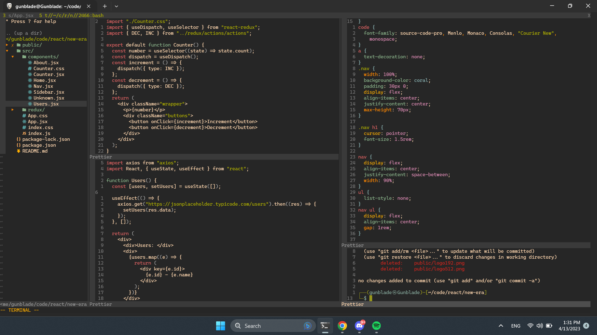

# vim-settings

ready to use vim settings

## screenshot

## installation

if using normal vim

- copy file contents to `.vimrc` file

if using neovim (preferred)

- put plugin, plugins, init.vim, lua, coc-config.json in `~/.config/nvim/`
  if its not there create it

- open `init.vim` and type `:PackerInstall` first
  to install packer (plugin manager)

- then type `:PlugInstall` to install the plugins

- restart vim/nvim or type `:source ~/<location of vim file>`

- install the nerd font (cascadia nerd) in your terminal or system to recognize nerd tree file icons

## general tips

- you can open nerdtree by hitting `<C-f>`

  more nerdtree tips by hitting `?` from within nerdtree

- you can navigate between split screens using `<C-{h, j, k, l}` where `h, j, k, l` are the normal vim navigate keys directions

- open split terminal using `<C-t>`

- exit terminal mode with `Esc` key

### if you are not using tmux or don't know what it is dont bother with these files

- .bashrc and .tmux.conf
  both should be at the home directory `~/`
